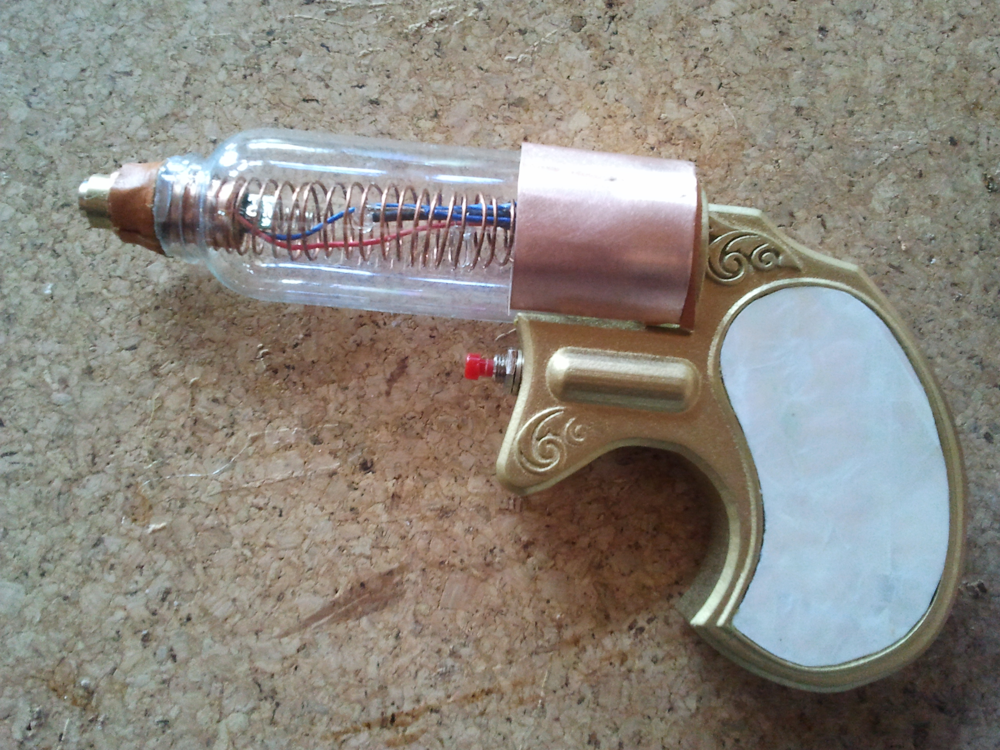
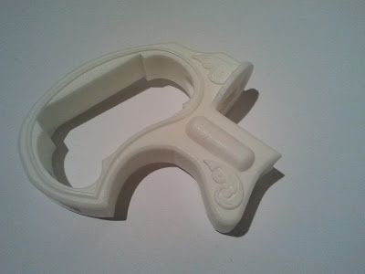
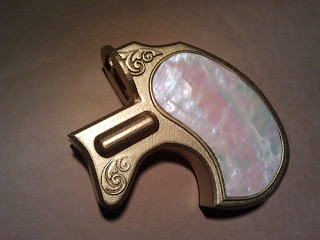
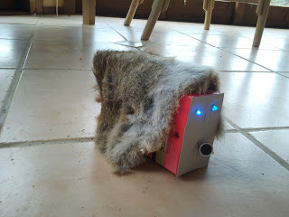
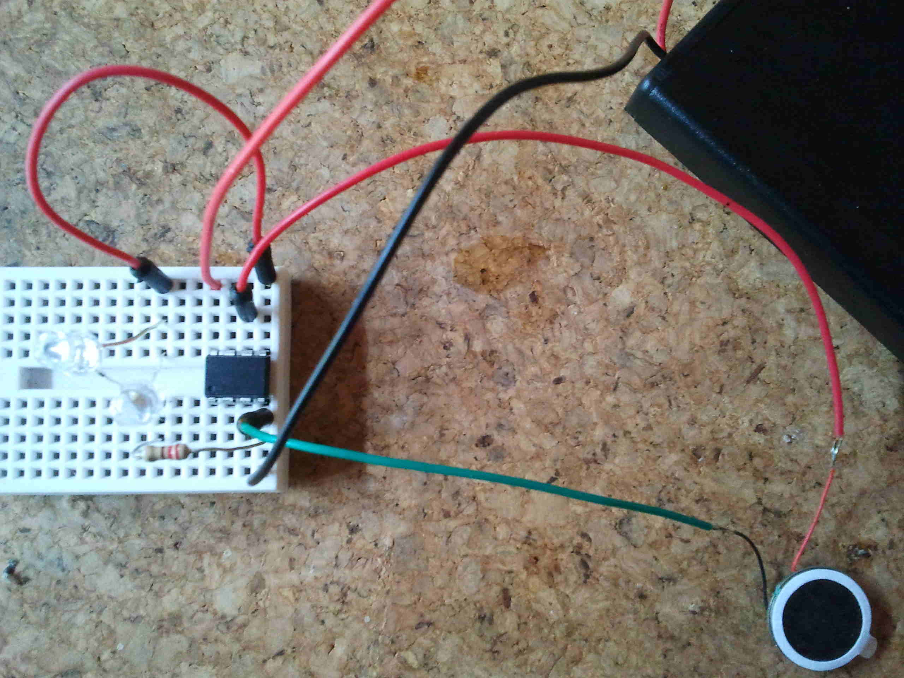

# steampunk-laser
Plays a noise on ATTiny85 using tone() PWM pin 4 and flashes a couple of LEDs

This code was loaded into an ATTiny85 that was embedded into a toy pistol with a laser pointer in the tip. When the trigger is pulled the tone sounds and the laser is turned on. There are a couple of blinking LEDs as well.

The finished laser looks like this:

[video](https://youtu.be/AGKMF4kWh64)

The handle was designed in blender and 3D printed with a spacein it to hold a LIPO battery.
This is the bare handle:

And this is the handle after painting and covering with fake mother of pearl.

[video](https://youtu.be/AGKMF4kWh64)

We adapted the idea to make a bird scarer with glowing eyes. Some minor changes to the circuit and the code and it wakes up every 15 minutes to scare swallows that were nesting on the side of a house. The noise was adjusted to sound like a growling animal. THis was powered by 2xAA batteries.
This was, in fact, a total failure. The swallows were initially bothers but in 3 weeks they had built a nest on top of it. The batteries were still going well, attesting to the usefulness of the ATTiny85's sleep function.

The circuit for this is shown here:

# Building the Software

We used Arduino IDE 1.6.7 with the [arduino-tiny core](https://code.google.com/archive/p/arduino-tiny/). The arduino-tiny-core is necessary for building ATTiny projects.
The Arduino IDE includes a Boards Manager which will install a core for ATTiny boards but this does *not* include the tone function. The code here will build fine under that core
but you will not hear anything from the speaker. However the arduino-tiny-core does not install automatically, you need do download it and unzip. See the readme file in the unzip. 
But even with that we had to edit the platform.txt file to point to the compiler and we had to move the empty85at*.hex files from ~/Arduino/hardware/tiny/avr/bootloader/empty to ~/Arduino/hardware/tiny/avr/bootloader.

To run the build in the IDE you need to pick the *ATtiny85 @ 1 MHz  (internal oscillator; BOD disabled)* board and then run the compile.

To load it into your board you need an [AVR programmer](https://www.sparkfun.com/products/11801).

# Hardware

This is the parts list for the electronics:
DIP
ATTiny85
Diode
Test button
battery
laser
Speaker
the other parts are either easy to find or up to you to chose what you like, eg the trigger we used is a push button that fitted into the handle.

